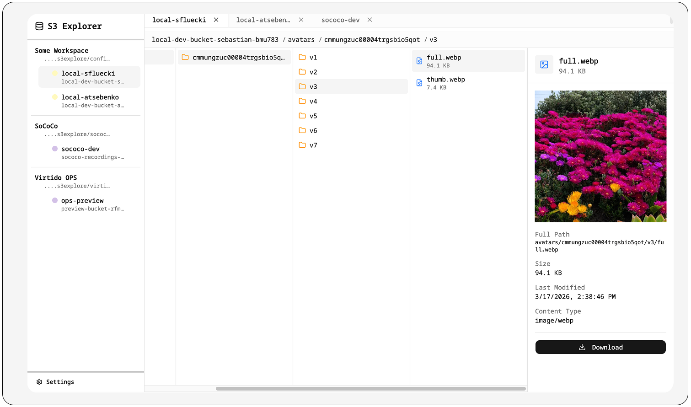

# S3 Explorer

A beautiful, secure S3 bucket explorer with encrypted credential storage. Browse and preview files from any S3-compatible storage (AWS S3, MinIO, Cloudflare R2, etc.) with a native macOS Finder-like column browser interface.



## Features

- **Column Browser Interface**: Navigate your buckets with a familiar Finder-style column view
- **Multi-Provider Support**: Works with AWS S3, MinIO, Cloudflare R2, and any S3-compatible storage
- **Encrypted Credentials**: All credentials are encrypted at rest using AES-256-GCM with scrypt key derivation
- **File Preview**: Preview images and text files directly in the browser
- **Multiple Workspaces**: Organize connections across multiple encrypted workspace files
- **Connection Groups**: Group and color-code connections for easy organization

## Installation

```bash
# Run directly with bunx (recommended)
bunx @sflueckiger/s3explore

# Or install globally
bun install -g @sflueckiger/s3explore
s3explore
```

## Requirements

- [Bun](https://bun.sh/) v1.0.0 or later

## Usage

When you first run S3 Explorer, you'll be prompted to create a new workspace or open an existing one. A workspace is an encrypted file that stores your S3 connection credentials.

### Creating a Connection

1. Click the **+** button in the sidebar
2. Enter your S3 credentials:
   - **Name**: A friendly name for this connection
   - **Bucket**: The bucket name
   - **Region**: AWS region (or use a custom endpoint)
   - **Endpoint**: For non-AWS providers (MinIO, R2, etc.)
   - **Access Key ID**: Your access key
   - **Secret Access Key**: Your secret key
3. Click **Save**

### Navigating Files

- Click folders to expand them in new columns
- Click files to preview them in the right panel
- Use the breadcrumb bar to navigate back
- Download files directly from the preview panel

## Security

S3 Explorer takes security seriously:

- **Local-only**: All data stays on your machine. No cloud sync, no telemetry.
- **Encrypted at rest**: Credentials are encrypted using AES-256-GCM
- **Key derivation**: Your password is processed with scrypt (N=2^17, r=8, p=1)
- **No credential logging**: Secrets are never logged or exposed via the API
- **Memory isolation**: Each workspace has its own encryption context

### Storage Location

Workspace files and configuration are stored in `~/.s3explore/`:

```
~/.s3explore/
├── workspaces.json          # List of known workspace paths
└── default.encrypted.json   # Default workspace (if created)
```

## Development

```bash
# Clone and install dependencies
git clone https://github.com/sflueckiger/s3explore.git
cd s3explore
bun install

# Run in development mode (backend + frontend with hot reload)
bun run dev

# Build for production
bun run build

# Run production build
bun run start
```

## Contributing

Contributions are welcome! Please feel free to submit a Pull Request.

1. Fork the repository
2. Create your feature branch (`git checkout -b feature/amazing-feature`)
3. Commit your changes (`git commit -m 'Add some amazing feature'`)
4. Push to the branch (`git push origin feature/amazing-feature`)
5. Open a Pull Request

## License

MIT License - see the [LICENSE](LICENSE) file for details.

## Author

Sebastian Flueckiger
